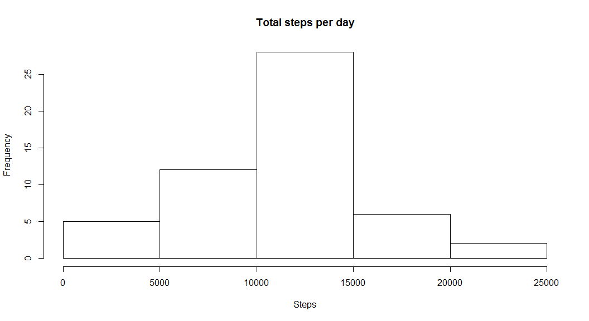
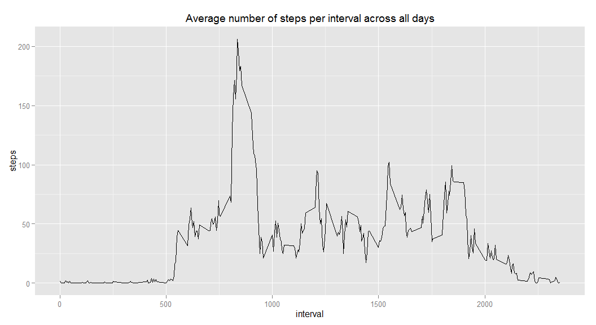

# Reproducible Research Peer Assessment 1
=======================================

## Loading in and preprocessing data

We assume that there is an activity.csv or activity.zip present in the current working directory


```r
# 0. Libraries needed
library(ggplot2)

# 1. Load the data
# Unzip archive if file does not exist
if(!file.exists('activity.csv')){
    unzip('activity.zip')
}
# Read in data file
dat <- read.csv('activity.csv')

# 2. Process/transform the data (if necessary) into a format suitable for your analysis
# Set date to the right date type 
dat$date <- as.Date(dat$date, "%Y-%m-%d")
```

## What is the mean total number of steps taken per day?


```r
# 1. Calculate the total number of steps taken per day
total <- aggregate(steps ~ date, dat, sum)

# 2. Make a histogram of the total number of steps taken each day
hist(total$steps, main= "Total steps per day", xlab="Steps")
```

 

```r
# 3. Calculate and report the mean and median of the total number of steps taken per day
mean(total$steps, na.rm=TRUE)
```

```
## [1] 10766.19
```

```r
median(total$steps, na.rm=TRUE)
```

```
## [1] 10765
```

## What is the average daily activity pattern?


```r
# 1. Make a time series plot (i.e. type = "l") of the 5-minute interval (x-axis) and the average number of steps taken, averaged across all days (y-axis)

dat.intval <- aggregate(steps ~ interval, data = dat, FUN = function(x) {
    mean(x, na.rm = TRUE)
})

ggplot(dat.intval, aes(interval, steps)) + geom_line(colour = "black") + labs(title = expression("Average number of steps per interval across all days"))
```

 

```r
# 2. Which 5-minute interval, on average across all the days in the dataset, contains the maximum number of steps?
dat.intval$interval[which.max(dat.intval$steps)]
```

```
## [1] 835
```

```r
max(dat.intval$steps)
```

```
## [1] 206.1698
```

## Imputing missing values

First, let's calculate the total number of missing values there are.  This denotes the total number of observations that did not have any steps recorded (i.e. those rows which are `NA`)


```r
# 1. Calculate and report the total number of missing values in the dataset (i.e. the total number of rows with NAs)
sum(is.na(dat$steps))
```

```
## [1] 2304
```

```r
# 2. Devise a strategy for filling in all of the missing values in the dataset. The strategy does not need to be sophisticated. For example, you could use the mean/median for that day, or the mean for that 5-minute interval, etc.
# 3. Create a new dataset that is equal to the original dataset but with the missing data filled in.

# using mean for that 5-minute interval, we will fill the missing data
dat.clean <- cbind(dat, dat.intval[,2])
names(dat.clean)[4] <- c("mean")

dat.clean$steps <- ifelse( is.na(dat.clean$steps), dat.clean$mean, dat.clean$steps)

# 4. Make a histogram of the total number of steps taken each day and Calculate and report the mean and median total number of steps taken per day. Do these values differ from the estimates from the first part of the assignment? What is the impact of imputing missing data on the estimates of the total daily number of steps?

cleantotal <- aggregate(steps ~ date, dat.clean, sum)
hist(cleantotal$steps, main= "Total steps per day", xlab="Steps")
```

 

```r
mean(cleantotal$steps, na.rm=TRUE)
```

```
## [1] 10766.19
```

```r
median(cleantotal$steps, na.rm=TRUE)
```

```
## [1] 10766.19
```

## Are there differences in activity patterns between weekdays and weekends?


```r
# 1. Create a new factor variable in the dataset with two levels – “weekday” and “weekend” indicating whether a given date is a weekday or weekend day.
weekdayend <- function(date) {
        if (weekdays(as.Date(date)) %in% c("Saturday", "Sunday")) {
                "Weekend"
        } else {
                "Weekday"
        }
}

dat.clean$day <- sapply(dat.clean$date, FUN = weekdayend)

# 2. Make a panel plot containing a time series plot (i.e. type = "l") of the 5-minute interval (x-axis) and the average number of steps taken, averaged across all weekday days or weekend days (y-axis). See the README file in the GitHub repository to see an example of what this plot should look like using simulated data.

summary <- aggregate(dat.clean$steps, list(interval = dat.clean$interval, day = dat.clean$day), 
    mean)
names(summary) <- c("interval", "day", "steps")

ggplot(summary, aes(interval, steps)) + geom_line(color = "black") + 
    facet_wrap(~day, ncol = 1) + labs(title = expression("Average number of steps taken"))
```

 
